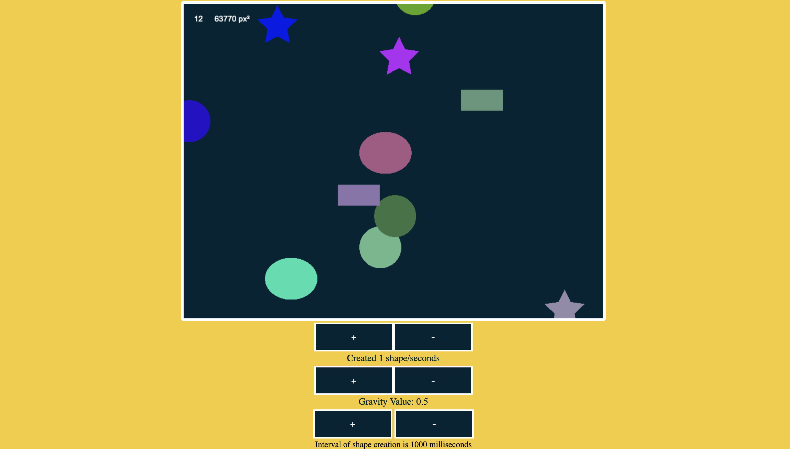
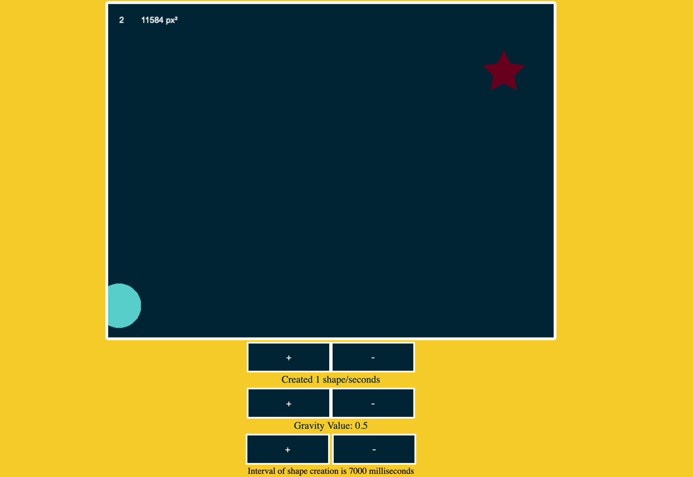
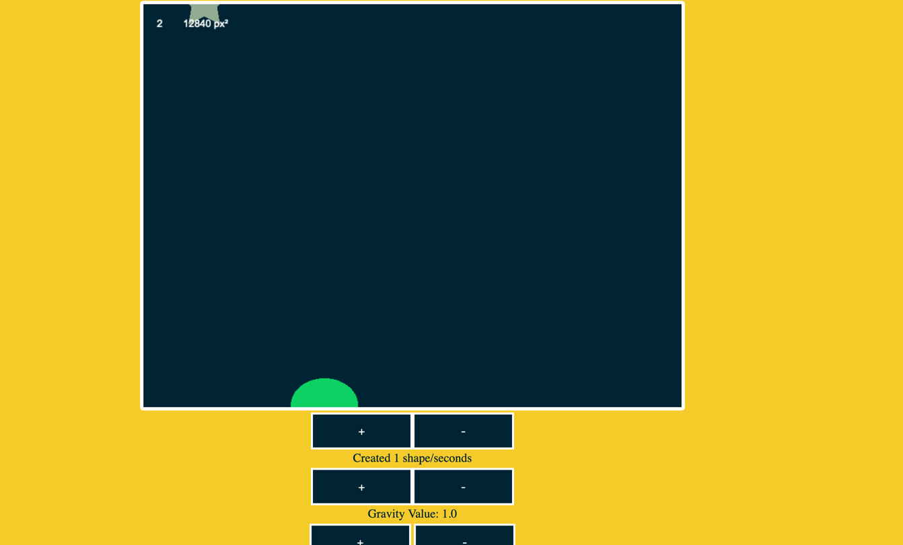
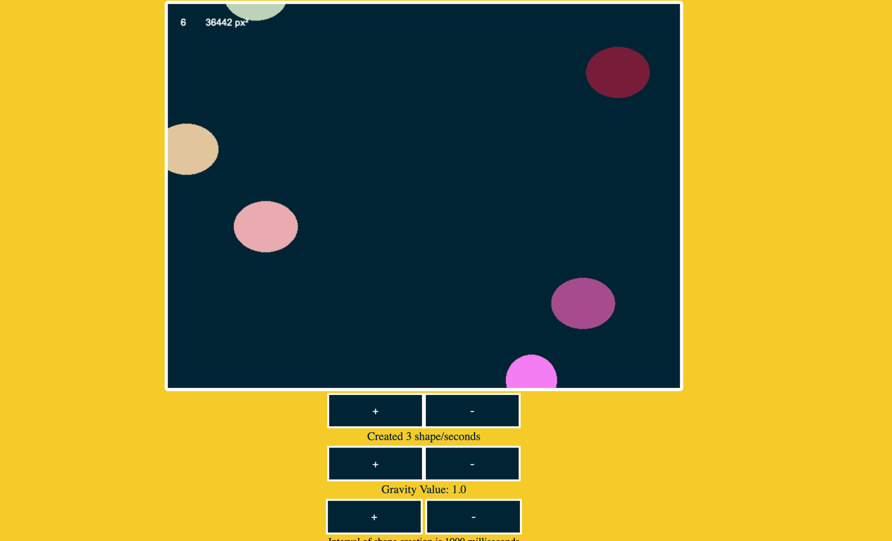

# PixiJS-game

## Used version 7.3.1 for PixiJS with downloaded '.mjs' file for using the technology.

## There are some screenshots to see the app:

### 1. Working app without any changes 

### 2. Set interval to 5 seconds

### 3. Set interval to 5 seconds and increase gravity value to see the difference

### 4. Creating shapes per second

